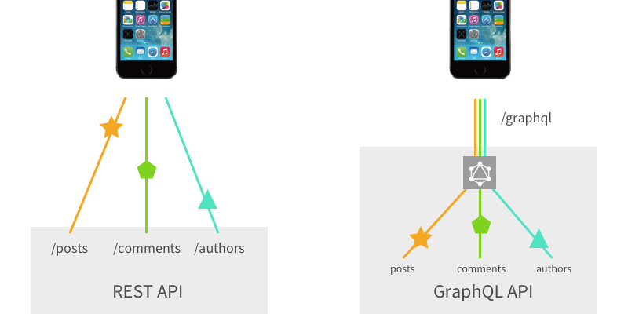

# Graph Database에 대해

## GraphQL과의 차이

graphQL -> REST API와 유사한 개념, GraphQL API라고 해서 엔드포인트 하나로 이것저것 처리하는 방식
클라에서 보낼때 원하는걸 결정가능

Graph Database는 따로있다는사실

## 기타 이해를 위한 링크들

https://1004jonghee.tistory.com/entry/Neo4j%EB%9E%80

https://www.joinc.co.kr/w/man/12/neo4j
